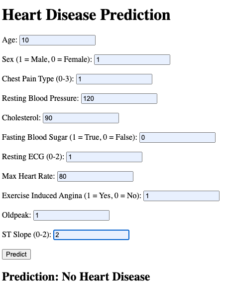
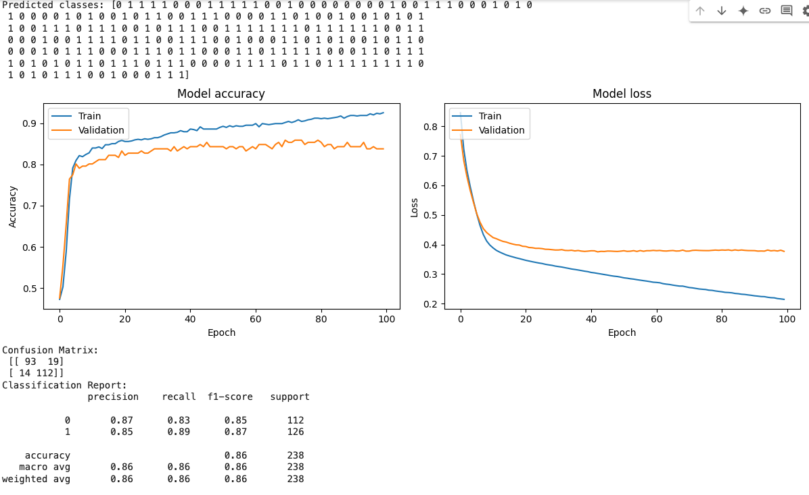

# Heart Disease Prediction Model
## Project Structure
Ensure your project directory is structured as follows:
```
heart_disease_prediction_model/
├── app.py
├── sample_data/
│   └── heart_statlog_cleveland_hungary_final.csv
└── templates/
    ├── index.html
```
### Files and Directories
app.py: The main Flask application file.
sample_data/: Directory containing the dataset.
templates/: Directory containing the HTML templates.
index.html: The main HTML file for rendering the home page

## Running the Flask Application
Open your terminal and navigate to the project directory:

cd /heart_disease_prediction_model
Set the FLASK_APP environment variable:

<pre>
export FLASK_APP=app.py  # On macOS/Linux
set FLASK_APP=app.py   # On Windows
</pre>

Run the Flask application:
```
flask run --port 5001
```


This should start your Flask application on port 5001. Now, navigate to http://127.0.0.1:5001 in web browser, Flask should correctly render index.html.



Using `heart_disease_prediction_model.py`.


We can also:
<pre>
df = './sample_data/heart_statlog_cleveland_hungary_final.csv'
df = pd.read_csv(df)
df
</pre>


```
df.columns

Index(['age', 'sex', 'chest pain type', 'resting bp s', 'cholesterol',
       'fasting blood sugar', 'resting ecg', 'max heart rate',
       'exercise angina', 'oldpeak', 'ST slope', 'target'],
      dtype='object')
```
